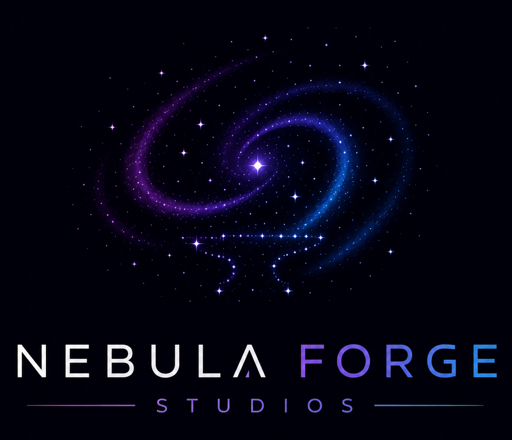

---
marp: true
theme: default
paginate: true
backgroundColor: #00000a
color: #ffffff
html: true
---

<!-- _header: "" -->

QA🔬

Revisão de Qualidade & Plano de Ação

# Nebula Drift v1.2.3

Lucas Jacques — QA Lead

P1–P7 fazem referência às perguntas do desafio técnico

---

QA🔬

# O cenário em números *(P1)*

<svg width="170" height="170" viewBox="0 0 180 180">
  <circle cx="90" cy="90" r="70" fill="none" stroke="#4a4a7a" stroke-width="24" />
  <circle cx="90" cy="90" r="70" fill="none" stroke="#ff5577" stroke-width="24"
    stroke-dasharray="141.4 439.8" stroke-linecap="round"
    transform="rotate(-90 90 90)" />
  <text x="90" y="84" text-anchor="middle" font-size="32" font-weight="bold" fill="#ffffff">9</text>
  <text x="90" y="106" text-anchor="middle" font-size="12" fill="#aaaacc">de 28 (32%)</text>
</svg>

● 28 críticos após freeze 
● 9 escaparam para produção

40% 
dos bugs detectados próximo ao release

3 dias 
tempo médio de correção

 

> O time está testando tarde demais, sem cobertura estruturada.

---

QA🔬

# O que precisa mudar *(P1)*

1. **Ausência de suíte de regressão** — sem baseline, não há como detectar sistematicamente o que quebrou entre builds
2. **Detecção tardia** — 40% dos bugs encontrados próximo ao release; 28 críticos identificados somente após freeze
3. **Alta taxa de escape** — 9 de 28 bugs críticos (≈32%) chegaram aos jogadores

**[RASCUNHO — considerar ícones ou imagem de "bug reaching players"]**

---

<!-- _class: lead -->

QA🔬

# 🚨 Bug crítico na v1.2.3
### Decisão imediata necessária *(P7)*

1 bug crítico · afeta 20% dos jogadores · correção: 2 dias · release: amanhã

**[RASCUNHO — considerar visual de semáforo vermelho ou "game over" como fundo]**

---

QA🔬

# 🚨 Bug crítico: como estamos respondendo *(P7)*

**Decisão: adiar o release 2 dias para corrigir. *(Opção A)*.**

- 20% dos jogadores afetados = impacto direto em retenção
- 2 dias de atraso é controlado e justificável frente ao risco de churn
- Lançar com bug crítico conhecido contradiz nosso compromisso com o jogador

**Opções consideradas e apresentadas ao PO e Dev Lead:**

| | |
|---|---|
| ✅ **Opção A** *(escolhida)* | Adiar 2 dias, corrigir e revalidar |
| ⚠️ **Opção B** | Lançar com workaround documentado, se existir |
| 🧪 **Opção C** | Soft launch para fatia menor da base, se a infra suportar |

> Este tipo de escape é exatamente o que o nosso plano a seguir vai endereçar.

---

QA🔬

# Como vamos testar *(P2)*

| Tipo | Quando | Foco |
|---|---|---|
| 🔥 **Smoke** | Após cada build semanal | Fluxos críticos: pagamento, progressão (~30 min) |
| 🔁 **Regressão** | Antes do freeze trimestral | Funcionalidades já validadas + os 9 escapes mapeados |
| 🔍 **Exploratório** | Durante o sprint | Áreas alteradas e de maior risco, sem script rígido |

 

**O que NÃO testar agora:** textos de NPC · arte cosmética · tutoriais opcionais · edge cases de hardware raros

**[RASCUNHO — considerar imagem de gameplay como fundo ou ícones de games]**

---

QA🔬

# Antecipando bugs: novo fluxo *(P3)*

**De:** tudo testado no final → **Para:** validação distribuída na sprint

 

- 🗓️ **Início da sprint** — QA no refinamento, revisando critérios de aceite
- 💻 **Durante o desenvolvimento** — QA testa features conforme ficam prontas
- 🏗️ **Build semanal** — smoke obrigatório; falhou = não avança
- 🔒 **Pré-freeze** — regressão com devs ainda disponíveis para corrigir

 

> Meta: reduzir os 40% de bugs tardios antecipando a detecção para quando o custo de correção ainda é baixo

**[RASCUNHO — candidato a virar uma linha do tempo visual horizontal]**

---

QA🔬

# QA no ciclo de produção *(P4)*

| Fase | Responsabilidade |
|---|---|
| 📋 Refinamento | Revisar critérios de aceite, levantar edge cases |
| 💻 Desenvolvimento | Testar features conforme prontas na branch |
| 🏗️ Build semanal | Smoke test — build que falha não avança |
| ⚠️ Pré-freeze | Regressão completa |
| 🔒 Freeze | Exploratório focado em risco |
| 🚀 Pós-release | Monitorar reports; validar hotfixes |

**[RASCUNHO — candidato a virar linha do tempo com fases do ciclo de desenvolvimento de um game]**

---

QA🔬

# Como vamos trabalhar *(P5)*

**Maria e José — execução:**
- Smoke tests semanais (após alinhamento inicial sobre critérios)
- Regressão em áreas estáveis e já mapeadas
- Reporte de bugs com template padronizado

**QA Lead — revisão e suporte:**
- Definir e priorizar o plano de testes a cada sprint
- Pair testing nas áreas críticas (pagamento, progressão)
- Interface com o time de desenvolvimento
- Sempre disponível para dúvidas — vocês não estão sozinhos nesse processo

**[RASCUNHO — considerar visual com dois "lados" ou organograma simples]**

---

QA🔬

# Desenvolvendo o time *(P6)*

| Semanas | Iniciativa |
|---|---|
| **1–2** | Diagnóstico: entender nível e lacunas de cada um no trabalho real |
| **3–4** | Pair testing nas áreas críticas — decisões discutidas em tempo real |
| **5–6** | Maria e José lideram o plano de testes de uma feature *(com revisão do Lead)* |
| **7–8** | Retrospectiva: o que melhorou, próximos objetivos |

 

**Métrica de sucesso:** redução de bugs encontrados no pré-freeze que deveriam ter sido capturados durante a sprint

**[RASCUNHO — considerar visual de progressão / level up como referência de games]**

---

QA🔬

# Plano de ação: próximas 2 semanas *(P1)*

1. **Regressão mínima baseada nos escapes** — mapear os 9 bugs que chegaram à produção, transformá-los em casos de teste e executar nas próximas builds semanais
2. **Shift-left no processo de sprint** — QA revisa critérios de aceite no início de cada sprint, antes do desenvolvimento começar
3. **Definition of done** — smoke pass + regressão mínima aprovada antes do freeze

 

> Pequenas mudanças, aplicadas de forma consistente, são o que vai transformar os números desta versão nas próximas.

**[RASCUNHO — considerar visual de roadmap ou checklist das 2 semanas]**
