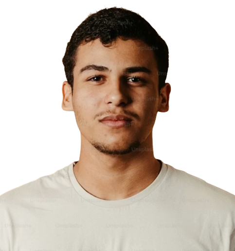

---
marp: true
theme: default
paginate: true
backgroundColor: #00000a
color: #ffffff
html: true
---

<!-- _header: "" -->

QA🔬

Revisão de Qualidade & Plano de Ação

# Nebula Drift v1.2.3

Lucas Jacques — QA Lead

P1–P7 fazem referência às perguntas do desafio técnico

---

QA🔬

# O cenário em números *(P1)*

<svg width="170" height="170" viewBox="0 0 180 180">
  <circle cx="90" cy="90" r="70" fill="none" stroke="#4a4a7a" stroke-width="24" />
  <circle cx="90" cy="90" r="70" fill="none" stroke="#ff5577" stroke-width="24"
    stroke-dasharray="141.4 439.8" stroke-linecap="round"
    transform="rotate(-90 90 90)" />
  <text x="90" y="84" text-anchor="middle" font-size="32" font-weight="bold" fill="#ffffff">9</text>
  <text x="90" y="106" text-anchor="middle" font-size="12" fill="#aaaacc">de 28 (32%)</text>
</svg>

● 28 críticos após freeze 
● 9 escaparam para produção

40% 
dos bugs detectados próximo ao release

3 dias 
tempo médio de correção

 

> O time está testando tarde demais, sem cobertura estruturada.

---

QA🔬

# O que precisa mudar *(P1)*

<svg width="150" height="140" viewBox="0 0 220 140" style="flex-shrink:0;">
  <defs>
    <marker id="arrowhead" markerWidth="8" markerHeight="8" refX="6" refY="3" orient="auto">
      <path d="M0,0 L6,3 L0,6 Z" fill="#aaaacc" />
    </marker>
  </defs>
  <line x1="22" y1="45" x2="10" y2="33" stroke="#ff5577" stroke-width="3" stroke-linecap="round"/>
  <line x1="58" y1="45" x2="70" y2="33" stroke="#ff5577" stroke-width="3" stroke-linecap="round"/>
  <line x1="18" y1="60" x2="2" y2="55" stroke="#ff5577" stroke-width="3" stroke-linecap="round"/>
  <line x1="18" y1="72" x2="2" y2="72" stroke="#ff5577" stroke-width="3" stroke-linecap="round"/>
  <line x1="18" y1="84" x2="2" y2="89" stroke="#ff5577" stroke-width="3" stroke-linecap="round"/>
  <line x1="62" y1="60" x2="78" y2="55" stroke="#ff5577" stroke-width="3" stroke-linecap="round"/>
  <line x1="62" y1="72" x2="78" y2="72" stroke="#ff5577" stroke-width="3" stroke-linecap="round"/>
  <line x1="62" y1="84" x2="78" y2="89" stroke="#ff5577" stroke-width="3" stroke-linecap="round"/>
  <ellipse cx="40" cy="75" rx="22" ry="30" fill="#ff5577" opacity="0.9"/>
  <line x1="40" y1="52" x2="40" y2="98" stroke="#aa2244" stroke-width="2"/>
  <path d="M95 75 L150 75" stroke="#aaaacc" stroke-width="2.5" stroke-dasharray="5 5" marker-end="url(#arrowhead)"/>
  <rect x="152" y="58" width="60" height="34" rx="16" fill="none" stroke="#55ccff" stroke-width="3"/>
  <line x1="168" y1="70" x2="168" y2="80" stroke="#55ccff" stroke-width="2.5" stroke-linecap="round"/>
  <line x1="163" y1="75" x2="173" y2="75" stroke="#55ccff" stroke-width="2.5" stroke-linecap="round"/>
  <circle cx="192" cy="70" r="3.5" fill="#55ccff"/>
  <circle cx="200" cy="78" r="3.5" fill="#55ccff"/>
  <text x="182" y="118" text-anchor="middle" font-size="12" fill="#aaaacc">jogador</text>
</svg>

<ol style="margin:0; padding-left:22px;">
<li style="margin-bottom:12px;"><strong>Ausência de suíte de regressão</strong> sem baseline, não há como detectar sistematicamente o que quebrou entre builds</li>
<li style="margin-bottom:12px;"><strong>Detecção tardia</strong> 40% dos bugs encontrados próximo ao release; 28 críticos identificados somente após freeze</li>
<li><strong>Alta taxa de escape</strong> 9 de 28 bugs críticos (≈32%) chegaram aos jogadores</li>
</ol>

---

<!-- _class: lead -->
<!-- _backgroundColor: #1a0508 -->

QA🔬

<svg width="90" height="90" viewBox="0 0 90 90">
  <defs>
    <radialGradient id="alertGlow" cx="50%" cy="50%" r="50%">
      <stop offset="0%" stop-color="#ff3355" stop-opacity="1"/>
      <stop offset="55%" stop-color="#ff3355" stop-opacity="0.45"/>
      <stop offset="100%" stop-color="#ff3355" stop-opacity="0"/>
    </radialGradient>
  </defs>
  <circle cx="45" cy="45" r="45" fill="url(#alertGlow)"/>
  <circle cx="45" cy="45" r="18" fill="#ff2244"/>
</svg>

# 🚨 Bug crítico na v1.2.3
### Decisão imediata necessária *(P7)*

1 bug crítico

20% dos jogadores

correção: 2 dias

release: amanhã

---

QA🔬

# 🚨 Bug crítico: como estamos respondendo *(P7)*

<svg width="40" height="40" viewBox="0 0 48 48">
  <rect x="6" y="6" width="26" height="34" rx="2" fill="#f5f0ff" stroke="#8866cc" stroke-width="2"/>
  <line x1="11" y1="15" x2="27" y2="15" stroke="#6a4fa8" stroke-width="1.5" opacity="0.8"/>
  <line x1="11" y1="21" x2="27" y2="21" stroke="#6a4fa8" stroke-width="1.5" opacity="0.8"/>
  <line x1="11" y1="27" x2="21" y2="27" stroke="#6a4fa8" stroke-width="1.5" opacity="0.8"/>
  <line x1="22" y1="40" x2="40" y2="22" stroke="#ffcc55" stroke-width="4" stroke-linecap="round"/>
  <circle cx="22" cy="40" r="3" fill="#ff8899"/>
  <circle cx="40" cy="22" r="1.6" fill="#2a2a3a"/>
</svg>

Decisão: adiar o release 2 dias para corrigir. <em>(Opção A)</em>.

- 20% dos jogadores afetados = impacto direto em retenção
- 2 dias de atraso é controlado e justificável frente ao risco de churn
- Lançar com bug crítico conhecido contradiz nosso compromisso com o jogador

> Este tipo de escape é exatamente o que o nosso plano a seguir vai endereçar.

---

<!-- _class: lead -->

QA🔬

# Como vamos testar *(P2)*

🔥

Smoke

🔁

Regressão

🔍

Exploratório

3 camadas complementares — cada uma com seu momento certo no ciclo

---

QA🔬

# Smoke, regressão e exploratório *(P2)*

🔥

Smoke

Após cada build semanal

Fluxos críticos: pagamento, progressão (~30 min)

🔁

Regressão

Antes do freeze trimestral

Funcionalidades já validadas + os 9 escapes mapeados

🔍

Exploratório

Durante o sprint

Áreas alteradas e de maior risco, sem script rígido

<strong>O que NÃO testar agora:</strong> textos de NPC · arte cosmética · tutoriais opcionais · edge cases de hardware específicos

---

QA🔬

# Antecipando bugs: novo fluxo *(P3)*

**De:** tudo testado no final → **Para:** validação distribuída na sprint

🗓️

Início da sprint

QA no refinamento, revisando critérios de aceite

💻

Durante o desenvolvimento

QA testa features conforme ficam prontas

🏗️

Build semanal

Smoke obrigatório; falhou = não avança

⚠️

Pré-freeze

Regressão com devs ainda disponíveis para corrigir

Meta: reduzir os 40% de bugs tardios antecipando a detecção para quando o custo de correção ainda é baixo

---

QA🔬

# QA no ciclo de produção *(P4)*
### Ciclo da Sprint

<svg width="700" height="400" viewBox="0 0 700 400" style="position:absolute; top:0; left:0;">
  <defs>
    <marker id="sprintCycleArrow" markerWidth="12" markerHeight="12" refX="9" refY="4.5" orient="auto">
      <path d="M0,0 L9,4.5 L0,9 Z" fill="#8888c0" />
    </marker>
  </defs>
  <path d="M350,62 Q500,149.5 531.85,227.56" fill="none" stroke="#8888c0" stroke-width="2.5" marker-end="url(#sprintCycleArrow)"/>
  <path d="M550,272 Q350,307 197.3,280.28" fill="none" stroke="#8888c0" stroke-width="2.5" marker-end="url(#sprintCycleArrow)"/>
  <path d="M150,272 Q200,149.5 308.54,86.19" fill="none" stroke="#8888c0" stroke-width="2.5" marker-end="url(#sprintCycleArrow)"/>
</svg>

📋

Refinamento

Revisar critérios de aceite, levantar edge cases

💻

Desenvolvimento

Testar features conforme ficam prontas na branch

🏗️

Build semanal

Smoke test — build que falha não avança

repete a cada sprint semanal

---

QA🔬

# QA no ciclo de produção *(P4)*
### Ciclo de Release

<svg width="700" height="400" viewBox="0 0 700 400" style="position:absolute; top:0; left:0;">
  <defs>
    <marker id="releaseCycleArrow" markerWidth="12" markerHeight="12" refX="9" refY="4.5" orient="auto">
      <path d="M0,0 L9,4.5 L0,9 Z" fill="#8888c0" />
    </marker>
  </defs>
  <path d="M350,62 Q500,149.5 531.85,227.56" fill="none" stroke="#8888c0" stroke-width="2.5" marker-end="url(#releaseCycleArrow)"/>
  <path d="M550,272 Q350,307 197.3,280.28" fill="none" stroke="#8888c0" stroke-width="2.5" marker-end="url(#releaseCycleArrow)"/>
  <path d="M150,272 Q200,149.5 308.54,86.19" fill="none" stroke="#8888c0" stroke-width="2.5" marker-end="url(#releaseCycleArrow)"/>
</svg>

⚠️

Pré-freeze

Regressão completa

🔒

Freeze

Exploratório focado em risco

🚀

Pós-release

Monitorar reports; validar hotfixes

repete a cada release trimestral

---

QA🔬

# Como vamos trabalhar *(P5)*

Maria e José — execução

<ul style="margin-top:10px; padding-left:20px; font-size:13px;">
<li>Smoke tests semanais (após alinhamento inicial sobre critérios)</li>
<li>Regressão em áreas estáveis e já mapeadas</li>
<li>Reporte de bugs com template padronizado</li>
</ul>

L. Jacques — revisão e suporte

<ul style="margin-top:10px; padding-left:20px; font-size:13px;">
<li>Definir e priorizar o plano de testes a cada sprint</li>
<li>Pair testing nas áreas críticas (pagamento, progressão)</li>
<li>Interface com o time de desenvolvimento</li>
<li>Início da automação de testes, conforme a stack do jogo</li>
<li>Sempre disponível para dúvidas</li>
</ul>

Responsabilidades diferentes, mas juntos com um mesmo objetivo.

---

QA🔬

# Desenvolvendo o time *(P6)*

LV

1

semanas 1–2

Diagnóstico

Entender nível e lacunas de cada um no trabalho real

LV

2

semanas 3–4

Pair testing

Decisões discutidas em tempo real nas áreas críticas

LV

3

semanas 5–6

Ownership

Maria e José lideram o plano de testes de uma feature <em>(com revisão do L. Jacques)</em>

LV

4

semanas 7–8

Retrospectiva

O que melhorou + início da automação (conforme stack do jogo)

🏆

Level up!

<strong>Métrica de sucesso:</strong> redução de bugs encontrados no pré-freeze que deveriam ter sido capturados durante a sprint

---

QA🔬

# Plano de ação: próximas 2 semanas *(P1)*

🎯

Regressão mínima baseada nos escapes

Mapear os 9 bugs que chegaram à produção, transformá-los em casos de teste e executar nas próximas builds semanais

🎯

Shift-left no processo de sprint

QA revisa critérios de aceite no início de cada sprint, antes do desenvolvimento começar

🎯

Definition of done

Smoke pass + regressão mínima aprovada antes do freeze

Pequenas mudanças, aplicadas de forma consistente, são o que vai melhorar os números das próximas versões.

